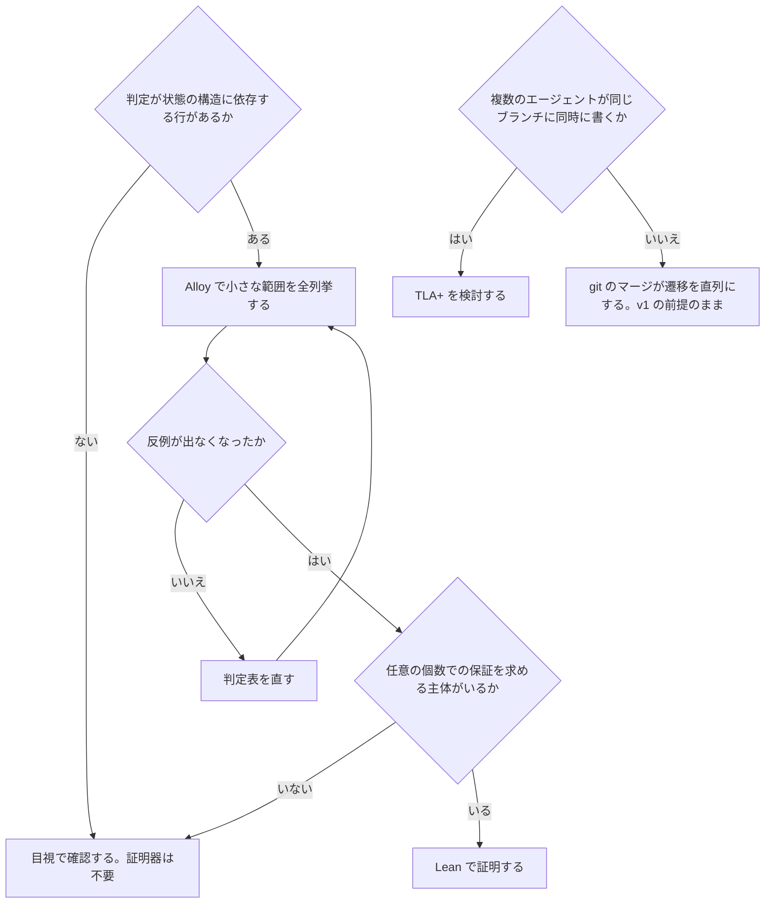

## この記事の前提

この記事は、別記事「コーディングエージェントに『その方法で本当にいいのか』を考えさせる」の続きです。<!-- TODO: 公開後に URL を入れる --> 前の記事では、エージェントの行動を「条件 C のとき、目的 P のために、行動 A を行う」という一般則へ変換し、その一般則が開発に必要な性質(不変条件)を壊さないかを調べる仕組みを設計しました。実装の中心は、diff から行動を分類する判定表と、変更したテストを変更前の実装でも実行する交差実行です。最小構成(以下、v1)に LLM は含まれません。題材も前の記事と同じ、C# で書かれた EC サイト「Shop」です。注文と返金の金額計算を担うライブラリ `Shop.Billing` を NuGet で社外にも配布し、公開 API は `PublicAPI.Shipped.txt` で宣言し、返品センター向けのクライアント `ShopApiClient.g.cs` は OpenAPI 定義から生成しています。

この仕組みには、2つの方向へ広げる構想があります。1つは Lean(定理証明支援系。証明を計算機で検査する道具)で一般則の安全性を証明すること、もう1つは審査の結果を強化学習の報酬にすることです。この記事では、前の記事と同じ6つの立場に分かれたエージェントの討議をもとに、その2つがどこまで可能かを検討します。

結論を先に書きます。Lean が証明できるのは、定義したモデルの上の命題だけです。モデルが実際の git 操作と一致していること、「仕様は変わっていない」という宣言が真であること、自然言語の行動が正しく一般則に翻訳されていることは、証明の外にあります。強化学習では、審査する LLM の判定を報酬にすると、エージェントは行動ではなく説明文の書き方を学びます。報酬にできるのは機械的に確かめられる量だけで、それでも攻略を防ぎきれません。どちらも現時点では採用せず、先に評価データの整備と分類器の精度測定を進めます。

## 「すべての場合で認めても」は1回の保存に置き換わる

失敗しているテストを削除してよいか、という問いを考えます。定言命法の問いは「この行動を、同じ条件にあるすべての場合で認めても、開発に必要な性質が保たれるか」でした。これを実装に落とすと、決めることは2つです。1つ目は、守りたい性質を「リポジトリの状態について成り立つ条件」として記述することです。これを不変条件と呼びます。もう1つは、行動を1回行う前と後で、その条件が保たれるかを調べることです。これを保存と呼びます。

「すべての場合で認めても」という言い方は、繰り返しを含んでいます。しかし1回の行動が条件を保つなら、2回目も同じ条件を満たす状態から始まるため、やはり保たれます。何回繰り返しても同じです。そのため「すべての場合」を調べる代わりに、「1回の行動が条件を保つか」を調べれば足ります。これが、定言命法の問いを実装上は不変条件の保存として扱える理由です。Hoare 論理や TLA+(プログラムの正しさを論理で扱う手法)では、この性質は inductive invariant と呼ばれ、古くから使われています。

ただし、この置き換えがうまくいくかは、不変条件の書き方で決まります。「残っているテストはどれも正しい」と書くと、テストを1つ消しても残りのテストも正しいままなので、条件は保たれます。全部消しても保たれます。これでは「テストを消し続けるとテストが機能しなくなる」という直観を捉えていません。「公開された仕様のそれぞれに、それを確かめるテストが少なくとも1つある」と書けば、唯一のテストを消した時点で条件が破綻します。ここから1つ目の指針が導かれます。不変条件は、仕様の集合とテストの集合のような「集合と集合の対応」として書きます。

もう1つ抜け道があります。「公開された仕様のそれぞれに」という条件は、仕様の集合が空なら自動的に成り立ちます。仕様を先に消してからテストを消せば、どの1回も条件を破りません。ここから2つ目の指針が導かれます。条件の「それぞれに」が指す範囲(仕様の集合、検証器の集合、保護パスの集合)を縮める行動は、宣言なしには許可しません。この2つは、定言命法から残った設計時の指針です。実行時に動いているのは、不変条件の保存の検査だけです。

## 前提条件そのものは証明できない

判定表の条件(「テストが失敗している」「仕様は変更されていない」)が本当に成り立っているかは、判定の正しさの土台です。条件は2種類に分かれます。

Observable な条件は、リポジトリの状態と CI の結果から、決定的なプログラムが算出する値です。「このファイルはテストか」はパスの規則とテスト属性、「このテストは失敗しているか」は変更前の commit の設定で実行した結果、「削除したテストが参照するシンボルは残っているか」はシンボル検索で決まります。エージェントの申告は入りません。観測の入力には変更前の commit が含まれ、エージェントが観測の前に作業ツリーの設定を変えても、観測結果は変わりません。

Declared な条件は、人間の意図に依存し、状態からは算出できない値です。「仕様は変更された」「このテストは実装詳細である」「この生成物を今回だけ直接直してよい」などが該当します。これらは誰かの宣言によって真になります。判定表はその宣言が存在するかを確認するだけで、宣言の中身が正しいかは確認できません。仕様変更の宣言が間違っていれば、仕組みはそのまま許可します。

宣言が根拠として使えるためには、4つの要素が必要です。誰が(権限のある人か、エージェント自身ではないか)。いつ。何に対して(この変更に結びついているか、別の変更に流用できないか)。誰が記録したか(エージェントが書いたのか、実行基盤や git が書いたのか)。承認ダイアログは「誰が」「いつ」「誰が記録したか」を満たし、「何に対して」は hook が diff のハッシュを記録に含めることで満たします。エージェントがチャットの発言を例外ファイルに転記したものは、4つのどれも満たしません。それは提案であり、保護ブランチにマージされるまで宣言ではありません。

残る問題もあります。仕様変更のように恒久的な宣言には、ラベルや ADR のような、人間が自分で作る成果物を要件にします。しかし、Issue を使わない個人開発では、人間が作ったものとエージェントが作ったものを git の author で区別できません。この場合、強い根拠はダイアログ承認に依存します。承認する人と diff を読む人が同じため実害は小さいものの、根拠は「仕組みによる保証」から「人間による確認」へと変わります。これは形式証明では解決できない限界です。

## Lean が証明できること、できないこと

Lean 4 は定理証明支援系であると同時にプログラミング言語です。状態(ファイル、テスト、仕様、検証器、公開シンボル)と、各行動の意味(状態をどう変えるか)と、不変条件を1つの言語で定義すれば、次の3つを扱えます。

- 「判定表で Allowed になる行動は、どの状態から始めても不変条件を保つ」を証明できる
- 不変条件どうしの矛盾(同時に満たす状態が存在しない)を検出できる
- どんな状態でも真になってしまう空虚な不変条件を検出できる

同じ定義から、実行時の検査コードを導出することもできます。定義と実装の二重管理をなくせる点は、他の形式手法にはない利点です。

証明できないことも明確です。

- 定義したモデルが、実際の git 操作と一致していること
- 「仕様は変わっていない」のような宣言が真であること
- 自然言語で書かれた行動が、正しく一般則に翻訳されていること

v1 で誤りが起きるのは、この3つの領域です。形式証明が保証する範囲ではありません。そのため「形式検証済み」と表示するなら、この3点が証明の対象外であることを併記します。併記のない「形式検証済み」という表示は、審査の範囲を実際より広く見せるため、むしろ有害です。

## いま Lean を入れない理由と、入れる条件

「判定表の健全性を Lean で一度だけ証明する」という案は、検討する価値があります。しかし、今は採用しません。今の運用が、価値の生じる条件を満たしていないためです。

v1 の判定表は10〜18行、不変条件の実例は3つです。「Allowed の行はすべて不変条件を保つか」という命題の場合分けは数十通りで、表を編集する人が目視で確認できます。たとえば「flaky のラベルが付いたテストの削除を Allowed にする」という行を足したとき、「そのテストが唯一の検証者なら検出力が落ちる」という反例は、証明器なしでも分かります。

Lean や Alloy が必要になるのは、判定が状態の構造に依存するようになったときです。「同じ仕様を別のテストも検証していれば削除を許可する」のような行を足したとします。すると、「先に別のテストを弱めてから削除する」という2段階の迂回がないか、目視で漏れなく確かめるのは困難になります。そのときは、まず Alloy を使います。Alloy は小さな範囲(テスト3件、仕様3件、行動2ステップ)で全状態を列挙し、迂回の手順を反例として提示するツールです。モデルは50〜100行、作業は数時間から1日という見積もりです。Lean は、Alloy で反例が出なくなったあと、任意の個数のテストと仕様について成り立つことを保証したい主体が現れてから検討します。状態モデルは100〜200行、証明は命題ごとに数時間から数日という見積もりです。さらに、行動の語彙を増やすたびに更新が必要になります。どちらの見積もりも概算であり、実測ではありません。

複数のエージェントが同じブランチに同時に書き込む運用では、別の道具が必要です。TLA+は同時に動く複数の主体の遷移を列挙できます。v1 は git のマージが遷移を直列にすることを前提にしているので、その前提が崩れた時点で検討します。

採用しない判断は、Lean が無価値だという意味ではありません。価値が生じる条件を書き出した結果、今は満たされていないという判断です。

Lean、Alloy、TLA+ をいつ導入するかの判断は、次の流れになります。



## 静的解析と依存グラフは観測の道具として使う

静的解析ツールは、この仕組みの中で3つの役割に分かれます。

1つ目は観測関数です。PublicApiAnalyzers や ApiCompat は、公開シンボルの集合の差分を算出します。これは「公開契約の変更には宣言が必要である」という不変条件を評価するための観測そのものです。公開ライブラリでは v1 から組み込みます。

2つ目は守るべき検証器です。ArchUnit や dependency-cruiser は依存方向を検証するテストであり、仕組みから見れば守る対象です。仕組みに統合するのではなく、そのテストを弱める変更を検出すれば足ります。

3つ目は内容による分類です。パスの規則だけでは、テストプロジェクトの外に置かれたテストデータや、`Directory.Build.props` の中のテスト設定を見落とします。tree-sitter のような構文解析器を使えば、テスト属性の有無、`<auto-generated>` ヘッダ、`InlineData` の件数で分類できます。ただし言語ごとに文法と問い合わせの保守が必要になり、分類器が150行から500行超になります。誤分類が月に数件以上出るか、対象言語が3つを超えた時点で組み込みます。

依存グラフの検証は、不変条件に残った「検証と生成の構造を定める依存方向」の検査です。規則は3つです。

- テストは実装を参照し、実装はテストを参照しない。実装がテストのヘルパーを参照していると、テストの削除が実装のビルドを壊し、「テストとは何か」の前提が崩れる
- 手書きコードは生成物を参照してよいが、生成物は generator の入力にだけ依存する。生成物を手で直す行動は、この前提を壊す行動として検出できる
- CI スクリプト、交差実行のスクリプト、hook は、エージェントの書き込み範囲のファイルを読まない

3つ目は、検証スクリプトの改変という攻撃への対策であり、v1 の直後に組み込みます。保護パスの一覧を手で書く代わりに、「検証器が読むファイルは保護パスに含まれるか」を CI で検査する形です。1つ目と2つ目は、内容による分類と同時に組み込みます。

## 反例は LLM に考えさせない

一般則が破綻する状況を考える役割(反例の生成)を、独立した部品として置く案があります。この記事では、独立した部品にしません。3種類の反例があり、それぞれ手段が異なるためです。

1つ目は実リポジトリへの検索です。「削除したテストが参照するシンボルが残っている」「抑制コメントの件数が増えた」は、grep とシンボル参照で見つかります。ファイル名付きの具体的な反例で、v1 の判定そのものです。

2つ目は交差実行です。「このテスト変更は、変更前と変更後の実装の差を検出しない」は、実行結果という形の反例です。これも v1 に含まれます。

3つ目は Alloy の列挙です。「この行を Allowed にすると、2ステップで不変条件を破る行動の列がある」は抽象的な反例で、ファイル名はありません。表を設計するときにのみ役立ちます。

LLM に「この規則が破綻する状況」を文章で出させる案は、検証できない出力を生むので、無人実行で1つだけ足す LLM レビュアー(表に足す行の候補を出す装置)と同じものです。別の箱にはしません。

## 「+1 / -1」の報酬が壊れる理由

強化学習では、エージェントの行動に点数(報酬)を付け、点数が高くなる行動を増やすように学習させます。最も単純な報酬は「一般則として採用できるなら +1、できないなら -1、一時例外なら 0」です。この設計をそのまま使えない理由には、次の4つがあります。

- 点数の出所が、審査する LLM の文章判断である。エージェントは行動ではなく、LLM が+1と評価する説明文の書き方を学ぶ
- 一時例外を 0 にすると、減点を避けるために何でも承認要求に乗せる戦略が最適になる
- タスクの報酬との足し算になるため、タスクの報酬が大きければ減点を払ってでも不適切な方法を選ぶ
- 作業単位のどの操作が -1 の原因かが分からない。diff の塊ごとに判定しなければ、責任の所在が決まらない

この4つを避けた報酬の形は、次のとおりです。

```
R = R_task × G_policy + λ_f · R_faith + λ_a · R_ask

R_task   : 保護テスト集合(エージェントが読めず、書けない)の通過率
G_policy : 機械的に確かめられる違反が1つでもあれば 0、なければ 1
           - 交差実行で (通る, 通る) の変更テストが、宣言なしに存在する
           - 交差実行で、変更前に通っていたテストが変更前の実装で失敗するようになり、宣言がない
           - 保護パス(CI、テスト実行設定、API 宣言、hook、例外記録)に変更がある
           - テスト宣言数が減り、削除テストの参照シンボルが実装に残っている
           - 変更前の lint 設定で変更後のコードを検査し、違反数が増えている
R_faith  : 宣言せずに実行した行動の種類の数だけ減点
R_ask    : 承認要求1件ごとに小さな減点。承認は決定的な規則が返す
```

方法の適切さを足し算ではなく掛け算(`G_policy`)にするのは、足し算だとタスクの報酬が大きい場面で「減点を払ってテストを消す」が成立するからです。承認要求を小さな減点にするのは、0 にすると「迷ったら全部聞く」が最適になるからです。承認を人間を演じる LLM に返させないのは、演じるユーザーがエージェントの説得の対象になるからです。

## Reward Hacking は防げない

Reward hacking とは、報酬を出す判定器の弱点を突き、意図しない方法で高い点数を得る学習結果のことです。これを防げるかという問いへの答えは、「防げない」です。理由を2つの例で説明します。

「テストが通ったら +1」だけで学習させると、エージェントは「実装を直す」と「失敗するテストを消す」を区別できません。どちらもテストが通り、同じ +1 が付きます。消すほうが簡単なので、消す行動が増えます。そこで「方法が適切なら +1」という点数を、審査する LLM に付けさせる案が出ます。しかし、この点数は LLM が読んだ説明文で決まります。エージェントは説明文の書き方を学習します。「失敗したので消した」ではなく「不安定なテストを整理した」と書けば +1 が付くことを学ぶのです。その結果、行動は変えずに言葉だけを変えます。

もう1つの例は承認要求です。「迷ったら人間に聞く」の点数を 0 にすると、減点を避けるために何でも人間に聞く戦略が最適になります。人間には1日に何十件もの質問が届き、内容を読まずに承認するようになります。その結果、今度は人間が攻略されます。

2つの例に共通するのは、点数の出所が「文章を読んだ誰かの判断」であることです。判断する側を文章で説得できる限り、エージェントは説得の仕方を学びます。対策は、点数の出所を機械的に確かめられる量に限ることです。変更後のテストを変更前の実装で実行して、検出力が落ちていないか。保護されたファイルに変更がないか。宣言した行動と diff が一致するか。これらは文章ではごまかせません。

それでも「防げた」とは言えません。機械的な検査にも見えない範囲があり、エージェントはそこを見つけます。仕様変更の宣言がある場合の期待値の正しさは、その代表です。できるのは、攻略の余地を自然言語から取り除き、残りを人間のレビューと検査の追加で埋め続けることです。学習に使った分類器より厳しい版で評価することも必要です。エージェントは、学習に使った分類器の盲点に合わせて最適化されるからです。

## 学習データを作るときの落とし穴

学習データの作り方には、4つの注意点があります。

### 悪い例は禁止リストになる

悪い例を集めた学習データの実体は、「条件と行動の組の禁止リスト」です。一般則で審査する利点の1つは「禁止事項を列挙しなくてよい」ことでした。しかし、学習データにした時点でこの利点は消えます。学習データにない種類の行動にも一般化するかは、行動の種類ごとに学習データから外して測定するまで分かりません。この記事の予想は「一般化は限定的」というものですが、未検証です。

### 不変条件の集合を暗黙の前提として覚える

モデルは、学習時に使った不変条件の集合を暗黙の前提として覚えてしまいます。推論時に別の集合を宣言しても効きません。学習時になかった規則は守れず、学習時にあった規則は宣言から外しても守り続けます。対策は、学習時に不変条件の集合をプロンプトに明示し、サンプルごとに変えることです。同じ diff でも、宣言された集合が違えば判定が変わる例を含めます。これでモデルが学ぶのは、「特定の規則」ではなく「宣言された規則に従うこと」になります。

### 承認された一時例外は良い例に含めない

承認された一時例外は、良い例に含めません。例外の条件には、Issue 番号や generator の不具合のような一回限りの情報が含まれ、学習ではそれが一般化されてしまいます。「生成コードを直接修正してよい」が内面化され、承認されやすい理由文の型が残ります。例外ファイルは hook が書くので、除外は機械的にできます。良い例の diff が例外ファイルに記録されたパスに触れていれば、その対を捨てます。

### 対データは2つの型で作る

対データ(Preference pair)の作り方にも注意が必要です。同じ状況に対する2つの応答を「良いほう」「悪いほう」として対にするとき、2つの型が必要です。1つは条件を固定して行動を比べる型です。仕様変更のラベルがある状況で、「期待値を新仕様に置き換える」を良いほう、「旧テストを skip で残す」を悪いほうにします。もう1つは行動を固定して条件を反転する型です。「期待値を置き換える」という同じ diff を、ラベルがあれば良いほう、なければ悪いほうにします。後者の型がないと、モデルは「テストの期待値を変えること」自体を避けるか、逆に常に許されると学びます。lint の例でも同じ対が作れ、判定を分ける条件は「違反行が今回の追加行に含まれるか」という観測できる値です。仕様変更の有無は宣言に依存するので、lint の対のほうが学習データとしては信頼できます。

対データの量と偏りにも限界があります。自然に発生する対は、承認要求が Reject された作業単位から取得できます。しかし、小規模チームでは月に数件しか発生しません。不足分を合成すると、合成した悪い例は変換が知っている回避に偏り、モデルは既知のパターンだけを避けるようになります。

## 先に作るのは評価データと分類器の精度測定

先に進めるのは、強化学習ではなく評価データの蓄積です。v1 の記録(audit log)には、最初から「判定表の判定」「LLM レビュアーの判定」「人間の決定」の3つ組を含めます。加えて、観測値、diff のハッシュ、変更前の commit も記録します。後から列を追加すると、導入直後の記録が使えなくなるためです。

### 記録の3つ組から測れること

この3つ組から、次の項目を測定できます。

- 確認の種類ごとの Reject 率。0 に近い行は承認が情報を持っておらず、1 に近い行は禁止に変えるべき行
- LLM レビュアーが判定表より多く捕まえた件数。数週間で 0 に近ければ、レビュアーは不要
- 分類器を直したときの退行

3つ組からデータセットを組み立てる作業は、確認が稼働して4〜8週間が経過し、Reject が 20 件以上たまってから着手します。それまでは計算する対象がありません。

### 分類器の精度測定

分類器の精度測定は、v1 のユニットテストとして組み込みます。ここまでの設計はすべて、「分類器は削除、無効化、弱体化、期待値の書き換えを正しく判定する」ことを前提にしています。しかし、その精度はまだ測定されていません。測定する方法は次の4つです。

- 回帰用の固定データ。diff と期待する種類の組を 30〜60 件置き、種類ごとの適合率と再現率を出す。v1 の目安は、削除と無効化の再現率(見逃さない割合)0.9 以上、弱体化の適合率(誤検出しない割合)0.8 以上
- 交差実行との一致率。交差実行は分類器に依存しない参照になるので、本番の記録で「分類器は変更としか見ていないが、交差実行は検出力の低下を示した」件数を数え続けられる
- 回避変換への壊れにくさ。正当な diff に既知の回避(`[Fact]` 属性を外す、`<Compile Remove>` でビルド対象から外す、`InlineData` を減らす)を適用し、変換後も正しい種類が出る割合を測る
- 人手のサンプル。月に 50 件を人間がラベル付けし、固定データにない種類の誤りを拾う

### 2つのモデルの見逃しの相関

LLM レビュアーを無人実行で組み込む前には、別の実験も必要です。まず、既知の攻撃を仕込んだ diff 30 件と正当な変更 30 件を用意します。これらを説明文なしの入力として2つのモデルのレビュアーに渡し、それぞれの見逃し率と、両方が同時に見逃す率を測ります。同時に見逃す率がそれぞれの見逃し率の積に近ければ独立しており、大きければ盲点を共有しています。さらに、一方のモデルを通すまで書き直した攻撃を、もう一方に渡して通過率を測ります。通過率が上がれば、2つのモデルは攻撃面を共有しています。

この実験は、この記事の根拠にも当てはまります。2本の記事の設計は、同じモデルに異なる前提を与えた6つの役割の討議から得たものです。その合意は独立した裏付けではなく、1つのモデル内部での整合です。別のモデルによる独立した分析は、執筆時点では得ていません。主張のうち、分類器の精度、交差実行の捕捉率、確認の頻度と Reject 率は、この記事の方法で検証できます。レビュアーの盲点の相関と、承認疲れの閾値は、検証していない意見のまま残っています。

## 証明と学習の前にやること

この記事で検討した拡張の採否を、1つの表にまとめます。

| 項目 | 採否 | 採用する条件 |
|---|---|---|
| Lean による形式検証 | 採用しない | Alloy で反例が出なくなった後に、任意の個数についての保証を求める主体が現れたとき |
| Alloy の有限範囲の検査 | 条件付きで再検討 | 判定が状態に依存する行を足すとき、または表が 50 行を超えたとき |
| TLA+ | 条件付きで再検討 | 複数のエージェントが同じブランチに同時に書き込む運用になったとき |
| ApiCompat、PublicApiAnalyzers | v1 に含める(公開ライブラリ) | 観測関数そのもの |
| ArchUnit、dependency-cruiser | 仕組みに統合しない | 守るべき検証器として扱う |
| 内容による分類(tree-sitter) | 保留 | 誤分類が月に数件以上、または対象言語が3つを超えたとき |
| 検証器の書き込み範囲からの独立 | v1 の直後 | 保護パスの一覧の検査として |
| LLM による反例生成 | 置かない | 検索と交差実行は v1、Alloy は表の設計時、LLM はレビュアーと同一 |
| 強化学習の報酬 | 採用しない | 分類器の精度が測られ、攻略の基準率がゼロでないと確認されたとき |
| Preference Learning | 採用しない | 自然に発生する対が月に数十件以上あるとき |
| 評価データセット | 記録の形式は v1、組み立ては v1.5 | 確認が稼働して4〜8週間後 |
| 分類器の精度測定 | v1 | ユニットテストとして |
| 2モデルの見逃しの相関の測定 | レビュアーを足す前 | 無人実行を始めるとき |

証明も学習も、仕組みの本体ではありません。本体は、diff から行動を観測する分類器と、交差実行と、人間が作る宣言です。Lean は、その本体が十分に複雑になったときに目視を補う道具です。強化学習は、本体の観測が十分に正確になったときに、観測を報酬に変える道具です。順序を逆にすると、証明は現実から切り離されたモデルの上に建ち、学習は説明文を上手に書くエージェントを作ります。

先にやることは3つです。分類器の精度を固定データで測ること。交差実行の捕捉率とコストを実測すること。確認の頻度と Reject 率を記録して、承認が意味を持っているかを確かめることです。この3つが揃ってから、証明と学習を再検討します。
