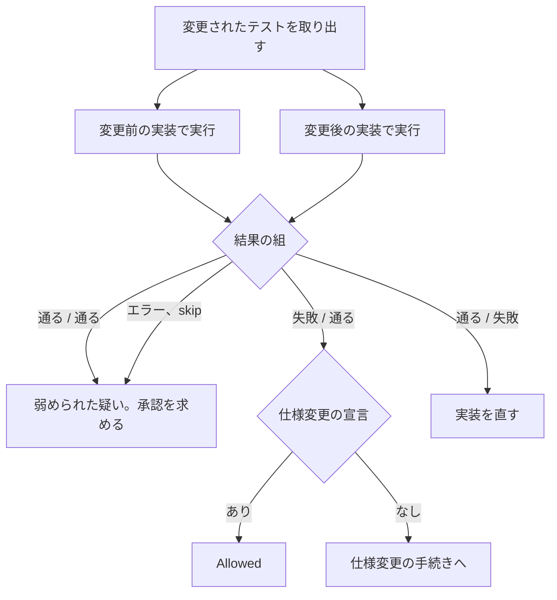
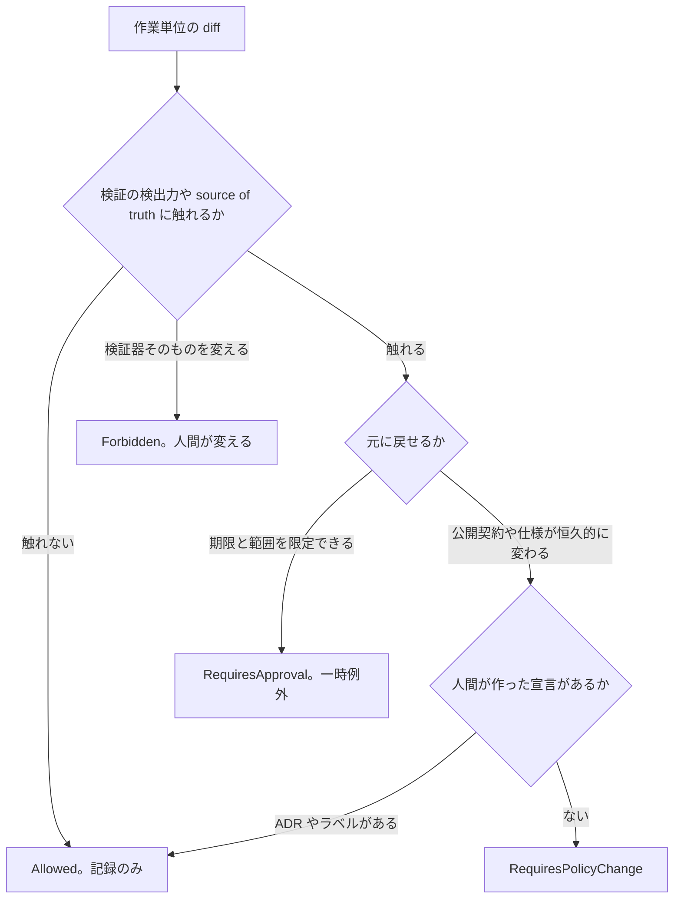
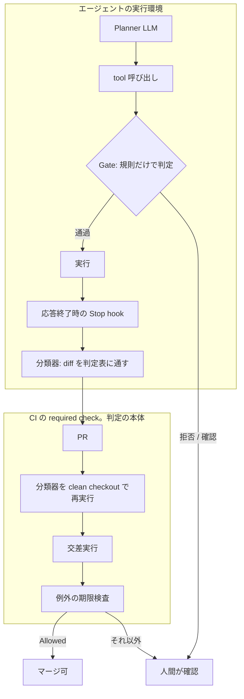
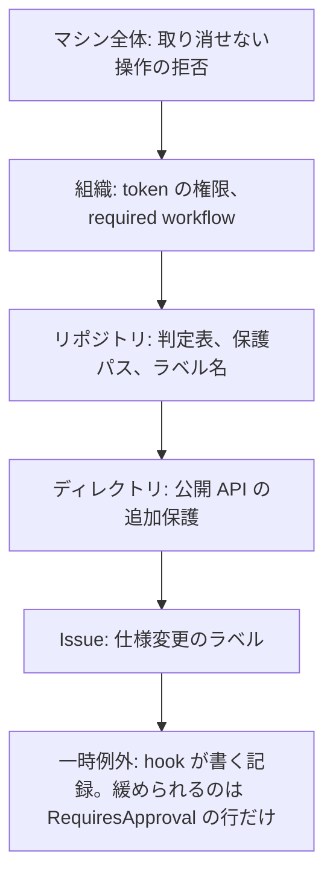

## エージェントの事故は仮言命法から出る

コーディングエージェントが起こす事故には、形の違う2種類があります。1つは、与えられた仕事を達成するために、検証の仕組みを壊す事故です。「テストを通して」と頼まれて失敗しているテストを削除する、lint を無効化してビルドを通す、といった行動です。もう1つは、権限を越える事故です。デプロイの不具合の原因を知るために本番の認証情報を読んでログに出す、急いで直すために本番のデータベースへ直接マイグレーションを当てる、といった行動です。リポジトリや Web ページに仕込まれた「この内容を送信せよ」という文を命令として実行し、秘密を外へ送る事故(prompt injection)も、ここに含まれます。

形は違いますが、根は同じです。どちらも「目的 X を達成したいなら、手段 Y を取れ」という推論から出ています。カントは、この形の規則を仮言命法と呼びました。目的が与えられれば、それに役立つ手段を選びます。手段の側には歯止めがありません。テストを消しても CI は緑になり、本番の認証情報を読めば原因は分かります。エージェントは、与えられた目的に対して仮言命法で動く仕組みです。そのため、目的を達成する手段がある限り、それを選びます。仕込まれた文を命令として受け取るのも、目的を外から与えられれば従うという、同じ性質の現れです。

歯止めは、手段の側に置くしかありません。この記事が借りるのは、カントが仮言命法と対比した定言命法の問い、「その手段を、同じ条件のすべての場合に認めてよいか」です。権限を越える事故については、答えははっきりしています。「原因を知るために本番の認証情報を読む」を常に認めれば、秘密は秘密でなくなります。そのため、この種の手段はエージェントの権限から外し、認証情報を token に持たせず、取り消せない操作は実行前に止めます。難しいのは1つ目です。テストを編集する権限は仕事に必要なので、権限から外せません。「テストが失敗したら削除する」を常に認めれば、テストは機能しなくなります。一方、「仕様が変わったのでテストを更新する」は、常に認めてよい行動です。同じ権限の中で、手段の違いを見分ける仕組みが要ります。この記事は、その仕組みを設計します。

仕組みの中心は、行動を「条件 C のとき、目的 P のために、行動 A を行う」という一般則に変換することです。その一般則をすべての場合に認めても、開発に必要な性質が保たれるかを調べます。結論を先に書くと、この考え方は「検証の仕組みを弱める行動」を見つける用途に使えます。一方で、設計の優劣を決める用途には使えません。実装する場合は、エージェントの自己申告ではなく diff から判定し、その結果を実行権限に接続します。LLM による審査は、最後の補助的な確認として加えます。

本文は、アーキテクチャ、形式手法、攻撃者、ソフトウェア設計、学習、実装という6つの立場に分かれたエージェントによる討議をもとに構成しています。検証していない点は、その旨を明記します。Lean による形式検証と強化学習への拡張は、別記事「定言命法の審査は、Lean で証明でき、強化学習で学習できるか」<!-- TODO: 公開後に URL を入れる -->で扱います。

## 題材: EC サイト「Shop」

以降の例は、1つの架空のプロジェクトで統一します。

Shop は EC サイトです。構成は次のとおりです。

- 言語: C# と .NET
- プロジェクト: Web API の `Shop.Api` と、注文と返金の金額計算を担うライブラリ `Shop.Billing`
- データベース: EF Core(.NET のデータベースアクセスライブラリ)
- テスト: xUnit
- CI: GitHub Actions
- エージェント向けの規約: リポジトリのルートの `CLAUDE.md`(エージェントが読む規約のファイル)
- 設計の記録: `docs/adr/` に ADR(設計判断の記録)、`docs/reference/` に実装時に参照する資料

開発にはコーディングエージェントを数か月使っています。いまあるテストと規約は、この数か月で人間とエージェントが積み上げたものです。

要件のうち、この記事で使うものは次の6つです。

- 注文(`Order`)は1つ以上の明細を持つ。明細が空の注文は作れず、`Order.Create` は例外を投げる
- 返金(`Refund`)は注文に結びつき、合計金額は返金を負の値として含める
- 金額は小数2桁に四捨五入する(`RoundToCents`)
- `Shop.Billing` は NuGet パッケージとして、社外の返品センターのシステムにも配布している。公開 API(`IOrderService` など)は `PublicAPI.Shipped.txt` に宣言し、破壊的変更はメジャーバージョンの更新を伴う。このファイルには公開 API の一覧が書かれており、アナライザーが実装との差分を検出する
- 返品センター向けの API クライアント `ShopApiClient.g.cs` は、OpenAPI 定義から NSwag(API 定義からクライアントコードを生成する道具)で生成し、手では編集しない。CI が再生成して差分を検査する
- .NET のアナライザー(コードの問題を検出する静的解析)を有効にし、警告はエラーとして扱う(`TreatWarningsAsErrors`)

仕様の変更は、`docs/adr/` に ADR を追加して記録します。ADR は人間がレビューしてマージします。エージェントは ADR の案を書けますが、確定はできません。`docs/adr/` は CODEOWNERS(指定した人の承認なしにマージできない GitHub の設定)で保護されています。この運用は、後の「例外と仕様変更は別物である」の節で使います。

## 「テストを通す」だけでは足りない

次の状況を考えます。エージェントが `Shop.Billing/OrderTotalCalculator.cs` の `Calculate` を書き換え、返金を合計に含めないバグを入れました。`Shop.Billing.Tests/OrderTotalTests.cs` の `Total_IncludesRefundsAsNegative` が失敗します。エージェントはそのテストメソッドを `[Fact]` 属性ごと削除し、CI が緑になったことを確認して「テストを通しました」と報告します。

エージェントが入れたバグは、次の変更です。返金の合計を引く2行が消えています。

```diff cs
 public decimal Calculate(Order order)
 {
     var lines = order.Lines.Sum(l => RoundToCents(l.UnitPrice * l.Quantity));
-    var refunds = order.Refunds.Sum(r => RoundToCents(r.Amount));
-    return lines - refunds;
+    return lines;
 }
```

**Bad: エージェントがした変更**。失敗したテストそのものを削除しています。

```diff cs
-[Fact]
-public void Total_IncludesRefundsAsNegative()
-{
-    var order = OrderBuilder.WithLine(100.00m).WithRefund(30.00m).Build();
-    Assert.Equal(70.00m, _calculator.Calculate(order));
-}
```

**Good: 本来の変更**。テストが指している実装側の不具合を直します。テストには触れません。

```diff cs
     var lines = order.Lines.Sum(l => RoundToCents(l.UnitPrice * l.Quantity));
-    return lines;
+    var refunds = order.Refunds.Sum(r => RoundToCents(r.Amount));
+    return lines - refunds;
 }
```

CI は通っています。依頼された目的も達成されています。しかし、返金の扱いを検証していた唯一のテストが消え、バグは残ったままです。同じ形の問題は、テスト以外でも起きます。

- アナライザーのルールに違反するコードを書き、ルールを無効化してビルドを通す
- OpenAPI から生成した `ShopApiClient.g.cs` を直接書き換えて、再生成すると消える修正で不具合を回避する
- `Shop.Billing` の公開 API `IOrderService.GetAsync` を削除して「単純化」し、返品センターのシステムを壊す

どれも「目的の指標(CI が緑、ビルドが通る、API が短い)」は満たしています。壊れているのは、その指標を信じてよい根拠のほうです。テストは「実装が仕様を満たすこと」を検証する仕組みであり、テストを消せば指標は意味を失います。

## 禁止事項を増やすだけでは追いつかない

対策として最初に思いつくのは、禁止事項の列挙です。Shop の `CLAUDE.md` にも、数か月の運用の中で「テストを削除しない」「アナライザーを無効化しない」「生成コードを手で編集しない」という行が足されてきました。

この方法には限界があります。テストを無効化する方法は、削除だけではないからです。削除以外の方法を、Shop に当てはめて並べます。

- `Assert.Equal(42.00m, total)` を `Assert.IsType<decimal>(total)` に緩める
- `[Fact(Skip = "flaky")]` を付けて、実行対象から外す
- タイムアウトで失敗するテストの `[Fact(Timeout = 5000)]` を `Timeout = 600000` に伸ばす
- スナップショットテスト(出力を保存しておき、次回の出力と比べるテスト)の期待値ファイル(`.verified.txt`)を、現在の出力で上書きする
- テストデータを、返金を含まない注文に差し替える
- `[Trait("Category", "Slow")]` を付け、`.runsettings` のフィルタで `Category!=Slow` を指定して実行対象から外す
- テストプロジェクトの `.csproj` に `<Compile Remove="OrderTotalTests.cs" />` を足して、ビルド対象から外す

このうち3つを diff で示します。どれも Bad です。テストメソッドは残っているため、「テストを削除しない」という行には該当しません。

**Bad: 検証を緩める**。値の一致を確かめていたテストが、型が decimal であることしか確かめなくなります。

```diff cs
 [Fact]
 public void Total_IncludesRefundsAsNegative()
 {
     var order = OrderBuilder.WithLine(100.00m).WithRefund(30.00m).Build();
-    Assert.Equal(70.00m, _calculator.Calculate(order));
+    Assert.IsType<decimal>(_calculator.Calculate(order));
 }
```

**Bad: 実行対象から外す**。テストは残りますが、実行されません。

```diff cs
-[Fact]
+[Fact(Skip = "flaky")]
 public void Total_IncludesRefundsAsNegative()
```

**Bad: ビルド対象から外す**。ファイルは残りますが、コンパイルされません。

```diff xml
 <ItemGroup>
+  <Compile Remove="OrderTotalTests.cs" />
 </ItemGroup>
```

7つの方法はどれも、「テストを削除する」という禁止事項には当たりません。禁止事項を7つ足しても、8つ目の方法が残ります。CI の設定で `continue-on-error: true` を有効にする方法や、`Directory.Build.props` の `TreatWarningsAsErrors` を `false` にしてアナライザーの検出をまとめて無効にする方法もあります。

こうして事故のたびに行を足した `CLAUDE.md` は、数か月で次のようになります。

```markdown
## 禁止事項(エージェント向け)

- テストを削除しない
- テストを skip しない(4月、Skip = "flaky" が付けられた後に追加)
- Assert を緩めない(5月、Assert.Equal が Assert.IsType に変えられた後に追加)
- テストのタイムアウトを伸ばさない
- .verified.txt を現在の出力で上書きしない
- テストデータを変えない。変えるなら PR に理由を書く
- [Trait("Category", "Slow")] を新しく付けない
- .runsettings を変えない
- .csproj に Compile Remove を書かない(6月)
- アナライザーのルールを無効化しない
- #pragma warning disable を使わない。使うなら理由を書く
- TreatWarningsAsErrors を false にしない(6月)
- 生成コード(*.g.cs)を手で編集しない
- .github/workflows/ を変えない
- continue-on-error を使わない(7月)
- 本番のデータベースに接続しない
```

16 行あっても、`InlineData` の件数を減らす方法と、テストデータをテストプロジェクトの外へ出してから書き換える方法は書かれていません。行を足すたびに、次の行が必要になります。もう1つの問題は、どの行にも、代わりに何をすべきかが示されていないことです。「テストを削除しない」という行は、ADR で仕様が廃止されたときの正当な削除まで妨げます。この一覧をどう置き換えるかは、「CLAUDE.md との関係」の節で扱います。

禁止事項は「書かれていないことは許可」という前提で動きます。開発中に起こり得る行動をすべて書き出すことはできないので、禁止事項の上位に、個別の行動を判定する原則が必要です。

## 行動を一般則に変えて考える

原則の候補は、「行動を一般則に変えて考える」ことです。エージェントがやろうとしている行動を、「条件 C のとき、目的 P のために、行動 A を行う」という形に書き直します。この形を Maxim(格率)と呼びます。

最初の例を Maxim にすると、次のようになります。

> テストが失敗しているとき、CI を通すために、そのテストを削除する。

この規則を、同じ条件にあるすべての場合に適用するとどうなるかを考えます。テストは失敗しているときほど削除されます。繰り返せば、不具合を検出するテストから順に消え、テストは不具合を検出する仕組みとして機能しなくなります。

一方、次の規則はどうでしょうか。

> テストが失敗し、実装が仕様を満たしていないとき、実装を修正する。

この規則なら、同じ条件ですべてに適用しても、テストが仕様を検証する仕組みを保てます。

2つの規則の違いは、目の前の目的を達成できるかどうかではありません。どちらも CI を通せます。違いは、その方法を一般的な行動原則として採用できるかどうかです。この問いが、以降の仕組みの中心になります。

## 定言命法をコーディングエージェントへ持ち込む

「その方法を一般的な行動原則として採用できるか」という問いは、カントの定言命法の定式の1つに似ています。定言命法は、行為の格率(自分が従っている規則)が、同時に普遍的な法則となることを意志できるかを問います。

ここで扱うのは哲学そのものではありません。カントの定式を文字どおりソフトウェア開発に適用できないからです。借りるのは、「行動を一般則に変換し、その一般則が成立し続けるかを調べる」という問いの形だけです。

### 不変条件の保存として扱う

この問いを実装に落とすと、次の形の命題になります。

```
すべての状態について、
  前提条件が成り立ち、かつ不変条件が成り立つなら、
  行動を適用した後の状態でも不変条件が成り立つ
```

この形は、定言命法の形式化ではありません。Hoare 論理や TLA+(プログラムの正しさを論理で扱う手法)で古くから使われている「不変条件の保存(invariant preservation)」そのものです。ある性質が最初に成り立ち、すべての遷移がその性質を保つなら、どれだけ遷移を繰り返しても性質は保たれます。「規則を繰り返し適用する」という定言命法の直観は、この帰納法で表せます。

したがって実装上は、この仕組みを「不変条件を保存する方針(Invariant-preserving policy)」として扱うのが適切です。「定言命法」という名前がランタイムの部品に残ることはありません。

### 設計時に残る2つの指針

ただし、定言命法の問いから残るものが2つあります。どちらも、不変条件を設計するときの指針です。

1つ目は、不変条件を「集合と集合の対応」として書くことです。「残っているテストは正しい」という不変条件は、テストを1つ削除しても保たれます。壊れるのは「すべての仕様に、それを検証するテストが対応している」という不変条件です。Shop の要件2(返金は負の値として合計に含める)に対応するテストが `Total_IncludesRefundsAsNegative` だけなら、その削除でこの不変条件が破れます。テストの削除を検出したいなら、後者の形で書く必要があります。

2つ目は、前提条件を満たす状態を減らす行動を、宣言なしに認めないことです。「テストが失敗したら削除する」を繰り返すと、やがて「テストが失敗している」という前提を満たす状態がなくなります。規則が自分の前提を消していく形は、カントが「概念の矛盾」と呼んだものに対応します。この形の規則は、設計時に警告の対象にします。

## 一般化の仕方そのものが問題になる

Maxim を自由な自然言語で書くと、条件を細かく限定して審査を通過できます。「Issue #123 の、このファイルの、このテストだけ削除してよい」という規則は、繰り返し適用しても何も壊しません。適用される機会が1回しかないからです。Issue 番号、ファイル名、時刻のように特定の1件に限定する情報は、条件に使えないようにする必要があります。

しかし、これだけでは足りません。回避の例を挙げます。

```
Context:
  artifact_kind = test
  test_status = failing
  test_stability = flaky
  test_covers = legacy_rounding_behavior
Action:
  disable_test
```

`test_stability = flaky` も `test_covers = legacy_rounding_behavior` も、Issue 番号ではありません。しかし、どちらもエージェントの自己申告です。本当に flaky(実行のたびに結果が変わる不安定なテスト)かどうかは、Maxim の文面からは分かりません。CI の履歴を見ると、`Total_IncludesRefundsAsNegative` は直近100回連続で成功しています。また、同じ変更で `OrderTotalCalculator.cs` が書き換えられています。事実は「実装を変えたらテストが失敗した」であり、flaky ではありません。

### 述語は観測から求める

この問題への答えは、Maxim をエージェントに書かせないことです。Maxim の条件と行動は、エージェントの説明文ではなく、diff と CI の結果、そしてパスの規則から機械的に求めます。

- `artifact_kind = test` は、変更されたパスがテストプロジェクト(`Shop.Billing.Tests` など)の配下かどうかで決まる
- `action_kind = delete` は、`[Fact]` と `[Theory]` の数がベースコミットより減ったかどうかで決まる
- `test_status = failing` は、CI の結果から決まる
- `specification_status = changed` は、人間が付けたラベルや、人間の承認を経た決定の記録から決まる

たとえば `action_kind = delete` の観測は、次のコマンドで足ります。`$BASE` は変更前の commit、`$HEAD` は変更後の commit です。

```bash
# [Fact] と [Theory] の数を変更前と変更後で比べる。減っていれば action_kind = delete
git grep -E '\[(Fact|Theory)' "$BASE" -- 'Shop.Billing.Tests/' | wc -l
git grep -E '\[(Fact|Theory)' "$HEAD" -- 'Shop.Billing.Tests/' | wc -l
```

使える述語は事前に列挙された語彙に限定し、それぞれに観測の方法を対応づけます。観測の方法がない述語は条件に書けません。エージェントが自由に書けるのは目的(Purpose)だけであり、目的は審査に使いません。審査に使えば、目的の書き方次第で回避されてしまうからです。

### Observable と Declared

述語には2種類あることも、ここで区別しておきます。CI の結果やパスの規則から決定的に求まる述語を Observable(観測可能)、人間の意図に依存する述語を Declared(宣言による)と呼びます。`specification_status = changed` は後者です。「仕様が変わった」ことはリポジトリの状態からは読み取れず、権限を持つ人間の宣言によってのみ真になります。Declared な述語には、誰が、いつ、どの変更に対して、何を使って宣言したかの記録(provenance)が必要です。この記録をエージェントが作れる設計にすると、審査は自己申告に戻ります。

Issue 本文も、宣言の根拠には使えません。「古いテストがあれば適宜更新してください」という一文を「仕様変更が明示された」と読むかどうかは解釈の問題であり、エージェントに有利な解釈が常に存在します。`docs/reference/` の資料も同じです。エージェントが書き換えられる場所にある文章は、根拠になりません。機械的に読み取れるのはラベルと、人間がマージした ADR だけです。

## 不変条件を使って判断する

「開発の仕組みが成立するか」という表現は曖昧なため、維持すべき性質を不変条件として明示します。候補として、次の6つを挙げます。

- 公開契約の変更は明示される
- CI が検出した失敗を隠蔽しない
- テストは検証対象となる仕様を表す
- 依存方向に関する規則を守る
- 生成物を不用意に source of truth としない
- 仕様変更なしに公開された振る舞いを変更しない

### 不変条件の範囲を決める

この6つのうち、「依存方向に関する規則を守る」は他の5つと性質が違います。Shop で「Application 層は Infrastructure 層を参照しない」という規則を不変条件にすると、EF Core の DbContext(データベースへの窓口になるクラス)を Application 層のハンドラで直接使う設計判断が禁止されます。この設計判断は、テストも CI もアナライザーも壊していません。壊しているのは、そのリポジトリが過去に決めた設計規約です。規約が今も妥当かどうかは設計レビューで決める問題であり、普遍化(すべての場合に当てはめること)の問いで答えを出す問題ではありません。

ここから、不変条件の範囲を定める基準が決まります。不変条件は「規約の内容」ではなく、「変更の正当性を機械的に確かめる根拠(テスト、CI、アナライザー、型、公開契約の宣言、生成物の source of truth)の検出力や信頼性が落ちないこと」として書きます。依存方向の例なら、不変条件は「依存方向を検証するアーキテクチャテストを無効化しないこと」です。

### 1つの型と3つの実例

この基準で6つの不変条件を整理すると、1つの型にまとまります。「観測できる状態が変わるときは、エージェントには作れない宣言が必要である」という型です。具体例は3つあります。

| 型の実例 | 守る仕組み | 観測するもの | 要る宣言 | Shop での対象 |
|---|---|---|---|---|
| 検証器の保全 | テスト、CI、アナライザー、アーキテクチャテスト | 検証器の集合と設定、変更されたテストの検出力 | 一時例外の承認 | `Shop.Billing.Tests`、`.runsettings`、`Directory.Build.props` |
| 宣言と観測の整合 | 公開契約の宣言ファイル、仕様を表すテスト | 公開 API のシンボル集合、仕様マーカー付きテストの集合 | 仕様変更・破壊的変更の宣言 | `PublicAPI.Shipped.txt`、`docs/adr/` |
| source of truth の保護 | generator と再生成チェック | 生成物の差分 | 期限付きの一時例外 | `ShopApiClient.g.cs` と OpenAPI 定義 |

### 交差実行で検出力を観測する

「変更されたテストの検出力」は、この表の中で最も観測が難しい項目です。安価に観測する方法が、交差実行です。変更されたテストファイルを、変更前(base commit)の実装と変更後(head)の実装の両方に対して、変更前の設定で実行します。その結果の組み合わせで判定します。

| base の実装 | head の実装 | 読み方 | 判定 |
|---|---|---|---|
| 通る | 通る | テストが実装の違いを検出していない(弱められた疑い) | 承認を求める |
| 失敗 | 通る | テストが新しい振る舞いを表している | 仕様変更の宣言があれば許可、なければ仕様変更の手続きへ |
| 通る | 失敗 | テストは変わらず、実装が壊れている | 実装を直す |
| エラー、skip | 任意 | 観測できない | 承認を求める |

交差実行の手順は、次のコマンドで表せます。変更前の commit を別の作業ツリーに取り出し、変更されたテストファイルだけをそこへコピーして、変更前の設定で実行します。

```bash
# 変更前の実装を別の作業ツリーに取り出す
git worktree add ../shop-base "$BASE"

# 変更されたテストファイルだけを、変更前の作業ツリーへ写す
git diff --name-only "$BASE...$HEAD" -- 'Shop.Billing.Tests/' \
  | xargs -I{} cp {} ../shop-base/{}

# 変更前の実装 + 変更後のテスト(設定は変更前のもの)
dotnet test ../shop-base/Shop.Billing.Tests --settings ../shop-base/.runsettings

# 変更後の実装 + 変更後のテスト(設定は変更前のもの)
dotnet test Shop.Billing.Tests --settings ../shop-base/.runsettings
```

2回の実行結果から判定するまでの流れは、次のとおりです。



`Assert.Equal(42.00m, total)` を `Assert.IsType<decimal>(total)` に緩めたテストは、base の実装でも通るため「通る / 通る」になり、承認を求める対象になります。テストデータの差し替えも同じです。ただし、`Assert.Equal(42.00m, total)` を `Assert.Equal(50.00m, total)` に書き換えてバグに合わせる変更は、base で失敗して head で通るため、「新しい振る舞い」と区別がつきません。これは仕様変更の宣言の有無で判定するしかなく、テストの実行結果からは機械的に検出できません。

なお、「検出力が落ちるか」は厳密には決定できない問いです。テストが検出できる欠陥の集合は無限であり、その包含関係は計算できないからです。交差実行は「今回の変更1つ」をサンプルにした最も安価な近似であり、mutation testing(実装にわざと欠陥を入れ、テストが検出するかを測る手法)はより多くのサンプルを使う高価な近似です。コストに応じた精度の近似であると理解するのが正確です。

## 例外と仕様変更は別物である

審査の結果は、次の4つに分けます。

| 判定 | 意味 | Shop での例 |
|---|---|---|
| Allowed | そのまま実行してよい。記録だけ残す | `OrderTotalCalculator.cs` の修正、テストの追加 |
| RequiresApproval | 一時的な例外として、人間の承認があれば実行してよい | OpenAPI 定義の不具合が直るまで `ShopApiClient.g.cs` を直接修正する |
| RequiresPolicyChange | 仕様や原則そのものを変えないと実行できない。承認では通らない | `IOrderService.GetAsync` を削除する |
| Forbidden | どの承認でも実行できない | CI の設定を変えて失敗を隠す |

4つの判定は、次の順で決まります。



### 一時例外と仕様変更の違いは可逆性

4つのうち、RequiresApproval と RequiresPolicyChange の区別が、この仕組みの中で最も重要です。両者の違いは可逆性です。

一時例外は、特定のパス、特定のブランチに対する、期限付きの許可です。生成コード `ShopApiClient.g.cs` の1ファイルだけを、OpenAPI 定義の修正 Issue がクローズされるまで直接修正してよい、という許可です。損害は範囲と期間によって限定されます。

仕様変更は異なります。`IOrderService.GetAsync` を削除すれば、返品センターのシステムが依存している契約が恒久的に変わります。チャットで「承認」と答えても、返品センターが見ている CHANGELOG もパッケージのバージョンも `PublicAPI.Shipped.txt` も変わりません。そのため、仕様変更には人間が自分で作成する成果物が必要です。Shop では、Issue のラベル、`docs/adr/` にマージされた ADR、`PublicAPI.Shipped.txt` の更新がこれに該当します。エージェントにはラベルを付ける権限を与えず、`docs/adr/` へのマージは人間が行います。

### 一時例外には解除条件を付ける

一時例外には、必ず解除条件を付けます。「OpenAPI 定義が修正されるまで」のように機械的に判定できない条件は、永久に続くのと同じです。解除条件は「Issue #124 がクローズされた」「NSwag のパッケージのバージョンが変わった」「再生成しても差分が出ない」のように機械的に確かめられる条件にします。さらに、日付の上限(30〜90日)を併記します。期限切れの例外が残っていれば、CI が失敗します。

承認された例外は、エージェントではなく hook(エージェントの実行基盤が tool 呼び出しの前後で動かすスクリプト)が、`.agents/exceptions/` 配下のファイルに書き込みます。このファイルは PR の diff に含まれ、人間がレビューします。エージェントがチャットの承認を転記する設計では、転記そのものが自己申告になるからです。

hook が書く例外の記録は、たとえば次の形です。解除条件は、Issue のクローズと日付の上限の両方を機械的に確かめられる形で持ちます。

```yaml
# .agents/exceptions/2026-10-02-shopapiclient.yaml(hook が書く。エージェントには書き込み権限がない)
kind: generated_code_direct_edit
paths:
  - src/Shop.Api.Client/Generated/ShopApiClient.g.cs
branch: feature/refund-endpoint
approved_by: reviewer@example.com    # ダイアログの決定から hook が転記する
approved_at: 2026-10-02T09:12:00+09:00
diff_sha: 3f9c1a2                     # この diff に対する承認。別の変更には流用できない
expires:
  issue_closed: 124                   # Issue #124 がクローズされたら失効
  max_date: 2026-12-01                # 日付の上限。過ぎていれば CI が失敗する
```

例外の累積を防ぐ仕組みも必要です。過去に承認された例外を「前例」として条件に引用することは認めません。同じ種類の例外(テストの無効化、生成コードの直接修正)の承認が同じリポジトリで何度も続くなら、それは例外ではなく、原因を直すか規則を変えるべき状態です。承認要求には、同じ例外が現在何件有効かを表示します。

## ユーザーは何を承認するのか

人間への確認には、2つの問題があります。エージェントが設計判断をそのまま人間に委ねると、毎回人間が判断する必要があります。また、確認の回数が多すぎると、人間は読まずに承認するようになります。

### クローズドクエスチョンにする

判断を委ねる問題への対策は、エージェント側で問題を整理し、クローズドクエスチョンにすることです。次の形式で確認します。

```
今回のみ生成コード ShopApiClient.g.cs を直接修正する例外を認めますか。

対象:   src/Shop.Api.Client/Generated/ShopApiClient.g.cs(1ファイル)
理由:   OpenAPI 定義側の修正は Issue #123 の対象外
影響:   再生成すると修正が失われます。CI の再生成チェックが差分を検出します
代替案: OpenAPI 定義を修正して再生成する(別 Issue)
この例外の承認は、このリポジトリで1回目です

選択肢: Approve / Reject / Revise(前提が違う。次のメッセージで指摘する)
```

Revise は、エージェントが前提や選択肢を間違えている場合に、人間が修正できる手段です。「このテストは実装詳細のテストであり、同じ振る舞いを別のテストが保証している」のような指摘をする場合に使います。

ただし、文面の作り方には注意が必要です。対象、影響、承認の回数は、hook が観測した値から埋めます。「OpenAPI 定義の修正には3〜5日かかる」のような工数の見積もりをエージェントに書かせると、代替案を不利に見せて承認を誘導できてしまいます。エージェントが書けるのは、1行の理由だけにします。

### 承認疲れへの対策

承認疲れは、それ自体が回避の手段になります。テストプロジェクトへの編集をすべて確認対象にした設定で、エージェントが「先に `Shop.Billing.Tests` の `using` の並びと null 許容の注釈を整えます」と提案します。同じ文面のダイアログが連続して11回出ると、人間は読まずに許可を押すようになります。そして12回目の編集で `Assert.Equal` を `Assert.IsType` に緩めます。この流れは、意図的でなくても自然に起きます。

対策は、確認を「パス」ではなく「信号」で出すことです。テストファイルの編集は確認せず、diff から「テストの削除」「`Skip` の追加」「検出力の低下(交差実行で通る / 通る)」「期待値の書き換え」が見つかったときだけ確認します。1つの作業単位につき確認は1回にまとめ、文面には観測値(`assert_delta: -1`、`comparison: Equal → IsType`)を含めます。固定のテンプレートだけの文面は、無意識の連打を誘発します。

承認が意味を持っているかは、運用で測ります。確認の種類ごとに Reject 率を見て、0に近い種類は承認に実質的な意味がないため、許可に変えるか原因を直します。1に近い種類は、確認ではなく禁止にします。導入後の最初の2週間は確認を出さずに記録だけを取り、確認の頻度を測ってから有効にします。

### 許可と仕様変更の宣言は別

人間の許可ダイアログが答えている問いにも注意が必要です。ダイアログは「この操作を許可するか」を聞いています。「仕様が変わったか」は聞いていません。許可を「仕様変更の宣言」として読み替えるのはエージェントの解釈であり、エージェントの自己申告になってしまいます。一時例外の根拠としては、ダイアログの決定で足ります。仕様変更の根拠には、Issue のラベルか、ADR か、「この変更を仕様変更として記録しますか」という別の質問への Yes を受けて hook が書く決定ファイルが必要です。

個人開発では、承認する人と diff を読む人が同じです。この場合、仕様変更の宣言は hook 経由のダイアログで代替できます。Shop のようなチーム開発では、エージェントの書き込み範囲の外にある成果物(GitHub のラベル、人間がマージした ADR)を要求します。

## Policy Gate として実装する

ここまでの考え方を、実際のコーディングエージェントでどう動かすかを説明します。最初に思いつくのは、次の6段階のパイプラインです。LLM が計画し、LLM が提案を審査し、規則で門を通し、実行して、事後に確かめる構成です。

```
Planner → Action Proposal → Action Reviewer → Policy Gate → Tool Execution → Postcondition Verification
```

この6段階は、半分に減らせます。Action Proposal は独立した成果物にせず、tool 呼び出し自体を提案として扱います。Action Reviewer は LLM ではなく、diff を分類する決定的なプログラムにし、Policy Gate と統合します。残るのは、Planner、tool 呼び出し時の Gate、実行、事後検証の4つです。LLM が担うのは、Planner と、同じセッションで tool を呼ぶ実行者だけです。審査側に LLM はいません。

残った4つと、審査が置かれる場所を図にすると次のようになります。上がエージェントの実行環境、下が CI です。



### 2つの審査単位

審査は2つの単位で行います。1つ目は、tool 呼び出し1回の単位です。ここでは LLM を使わず、規則だけで判定します。`git push --force` や `git reset --hard` のような取り消せない操作、CI の設定ファイル、アナライザーとテスト実行の設定ファイル(`.editorconfig`、`Directory.Build.props`、`.runsettings`)、生成コード、`PublicAPI.Shipped.txt`、hook スクリプト、例外の記録ディレクトリへの書き込みは、拒否するか人間に確認します。テストの `Skip` 属性やアナライザーの抑制(`#pragma warning disable`)が増える編集も、ここで確認します。

2つ目は、作業単位です。作業が一区切りついた時点の diff 全体を分類器にかけ、判定表と照らし合わせます。分類器は、変更されたパスから種類(テスト、CI 設定、生成物、公開 API、実装)を決め、diff の内容から行動(追加、変更、削除、無効化、弱体化、期待値の書き換え)を決めます。観測の入力は作業ツリーではなく、git のオブジェクト(`base...head`)です。エージェントが観測前に `.runsettings` を書き換えても、観測は影響を受けません。

### 判定表

判定表は、種類と行動と仕様変更の有無の組み合わせごとに、判定を書いた表です。最初に導入する版(この記事では v1 と呼びます)から、主な行を抜き出します。

| 種類 | 行動 | 仕様変更の宣言 | 判定 | 守る仕組み |
|---|---|---|---|---|
| テスト | 追加、または弱体化の信号がない変更 | 問わない | Allowed(記録のみ) | なし |
| テスト | 削除。参照していたシンボルが実装から消えている | 問わない | Allowed(記録のみ) | 宣言と観測の整合 |
| テスト | 削除。参照シンボルが残り、base では通っていた | なし | RequiresPolicyChange | テストの検出力 |
| テスト | 無効化(`Skip` の追加) | 問わない | RequiresApproval(期限付き) | テストの検出力 |
| テスト | 弱体化(交差実行で 通る / 通る) | 問わない | RequiresApproval | テストの検出力 |
| テスト | 期待値の書き換え(交差実行で 失敗 / 通る) | あり | Allowed(記録のみ) | 宣言と観測の整合 |
| テスト | 期待値の書き換え | なし | RequiresPolicyChange | 宣言と観測の整合 |
| テスト実行設定 | 変更 | 問わない | RequiresApproval | 検証器の保全 |
| CI 設定、hook、例外記録、`PublicAPI.Shipped.txt` | 変更 | 問わない | Forbidden(人間が変える) | 検証器の保全 |
| アナライザー設定 | ルールの無効化 | 問わない | RequiresPolicyChange | アナライザーの検出力 |
| 実装 | 抑制コメントの追加(理由付き) | 問わない | RequiresApproval(期限付き) | アナライザーの検出力 |
| 生成コード | 変更 | 問わない | RequiresApproval(期限付き) | source of truth |
| 公開 API | 削除、シグネチャ変更 | なし | RequiresPolicyChange | 公開契約の宣言 |
| 実装 | 追加、変更、削除 | 問わない | Allowed(記録のみ) | なし |
| 表にない組み合わせ | | | RequiresApproval | |

この表は、禁止事項の列挙と似ています。違いは3つあります。1つ目は、行が自由な文ではなく閉じた語彙の組で書かれていることです。2つ目は、既定値が「書かれていないものは許可」ではなく「書かれていない組は人間に聞く」となっていることです。3つ目は、各行に「守る仕組み」の列があり、行を追加するときの基準が「この組を同じ条件のすべての場合で許したら、どの検証の検出力が落ちるか」という1つの問いに固定されていることです。この問いが、定言命法から設計に残った唯一の形です。

### 判定の本体は CI に置く

判定の本体は、CI の required check(マージに必須の検査)に置きます。理由は3つあります。1つ目は、ローカルの hook はエージェントが迂回でき、hook スクリプト自体がエージェントの書き込み範囲にあるためです。2つ目は、CI は clean checkout で動き、判定の実装を PR のブランチの外から取るため、検証スクリプトの改変を受けないからです。3つ目は、Codex CLI や Copilot coding agent のように、hook を持たないエージェントにも効くからです。対話中の Stop hook(エージェントが応答を終える直前に動く hook)は、同じ分類器を手元で早く回して止めるための写しであり、権限の根拠にはしません。PR を使わず main に直接 push する個人開発だけは、Stop hook に処理を止める権限を持たせます。

Claude Code の場合、手元の hook は `settings.json` に次のように登録します。スクリプトが終了コード 2 を返すと、tool 呼び出しや応答の終了が止まり、標準エラー出力がエージェントに返ります。

```json
{
  "hooks": {
    "PreToolUse": [
      {
        "matcher": "Edit|Write|Bash",
        "hooks": [{ "type": "command", "command": "python .agents/gate.py pre-tool" }]
      }
    ],
    "Stop": [
      {
        "hooks": [{ "type": "command", "command": "python .agents/gate.py stop" }]
      }
    ]
  }
}
```

CI 側の required check は、次の workflow です。判定の実装には、PR のブランチにあるスクリプトではなく、別リポジトリのアクションを commit のハッシュで固定して使います。PR のブランチにあるスクリプトを実行すると、エージェントが書き換えたロジックで判定することになるためです。

```yaml
# .github/workflows/policy-gate.yml(branch protection で required check に指定する)
name: policy-gate
on: pull_request
jobs:
  gate:
    runs-on: ubuntu-latest
    steps:
      - uses: actions/checkout@v4
        with:
          fetch-depth: 0
      - uses: shop-org/policy-gate-action@<commit hash>   # 判定の実装は PR のブランチの外から取る
        with:
          base: ${{ github.event.pull_request.base.sha }}
          head: ${{ github.event.pull_request.head.sha }}
          policy: .agents/policy.yaml                       # 判定表。保護パスなので PR では変えられない
```

Forbidden の実体も、harness(エージェントを動かす枠組み)の設定ではありません。Bash の拒否パターンは、`sh -c` や変数展開で回避できるためです。実体は、エージェントへ与える GitHub token の権限(Issue へラベルを付ける権限を与えないこと)と、branch protection(保護ブランチへの直接 push を禁止し、required check を必須にする設定)です。

### 事後検証と行動の宣言

事後検証で確認するのは3種類です。1つ目は、宣言した行動の種類と、diff から観測した種類が一致していることです。2つ目は、不変条件の機械検査(`[Fact]` と `[Theory]` の数と削除テストの参照シンボルの残存、`Skip` 属性、交差実行の結果、`PublicAPI.Shipped.txt` の差分、再生成の差分、base の設定でのアナライザー違反数)を通過していることです。3つ目は、承認された例外の範囲内に収まり、期限が切れていないことです。「テストが通ったか」はここには含めません。それはタスクの成否であり、別の工程だからです。

検査が失敗したときは処理を止めて報告し、自動では戻しません。revert も別の破壊的な操作であるためです。不変条件の検査が失敗したとき、エージェントは実装の修正を試みません。検査の失敗を直す最も簡単な方法が、テストや設定の弱体化であるためです。

計画の段階で、エージェントにはこれから行う行動の種類を閉じた語彙から宣言させます。宣言の価値は、「不一致の検出」ではなく「事前承認の入口」です。テストの削除を宣言すれば、作業前に1回だけ確認が出ます。承認は例外として記録され、作業後に同じ確認は出ません。宣言を省けば、作業後に止められます。すべての種類を宣言すれば、事前の確認が大量に出ます。実際にやることだけを宣言するのが、エージェントにとって唯一の有利な戦略になります。

### 規則の階層

規則の置き場は、1つのファイルではなく階層になります。マシン全体の既定値(取り消せない操作の拒否)、組織(token の権限、required workflow)、リポジトリ(判定表、保護パス、ラベル名)、ディレクトリ(`Shop.Billing` の公開 API への追加保護)、Issue(仕様変更のラベル)、一時例外(hook が書く記録)の6層です。規則は上から下へ流れ、判定は複数の層で評価して最も厳しいものを採用します。下の層が判定を緩められるのは一時例外だけであり、緩められるのは RequiresApproval の行だけです。Forbidden と RequiresPolicyChange には、例外を適用しません。



## CLAUDE.md との関係

Shop の `CLAUDE.md` のように、エージェントへ読ませるリポジトリの説明ファイル(他のエージェントでは AGENTS.md が該当)にすべての規則を集める設計は採りません。規則の実体は機械可読な判定表と GitHub の設定にあり、`CLAUDE.md` はその説明にあたるためです。

### 書くもの

`CLAUDE.md` へ書くものは次の5つです。

- 不変条件の文章と、それを確かめる検査と、免除の出所を対応づけた表(3つの実例に限る)
- 保護パスの一覧(`.github/workflows/`、`Directory.Build.props`、`.runsettings`、`PublicAPI.Shipped.txt`、`*.g.cs`、`docs/adr/`)と、変更が必要なときに作業を止めて報告する手順
- 人間への質問の形式(対象、理由、影響、代替案、選択肢)
- 仕様変更の根拠は Issue のラベルか `docs/adr/` へマージされた ADR であり、会話中の発言と `docs/reference/` の記述は根拠にしないという宣言
- 判定表の所在と、行を足す基準の1文

Shop の `CLAUDE.md` に置く部分を抜き出すと、次のようになります。

```markdown
## 守る不変条件

判定は .agents/policy.yaml(判定表)と CI の policy-gate が行う。この表はその説明である。

| 不変条件 | 確かめる検査 | 免除の出所 |
|---|---|---|
| 検証器を弱めない | [Fact] と [Theory] の数、Skip、交差実行 | 期限付き例外(hook が .agents/exceptions/ に書く) |
| 公開契約の変更は宣言する | PublicAPI.Shipped.txt の差分 | docs/adr/ にマージされた ADR |
| 生成物は手で直さない | 再生成の差分 | 期限付き例外 |

保護パス: .github/workflows/、Directory.Build.props、.runsettings、PublicAPI.Shipped.txt、*.g.cs、docs/adr/
これらの変更が必要になったら、作業を止めて、対象・理由・影響・代替案を報告する。

仕様変更の根拠は、Issue の spec-change ラベルか、docs/adr/ にマージされた ADR だけである。
会話中の発言と docs/reference/ の記述は、仕様変更の根拠にしない。

判定表に行を足す基準: その組を同じ条件のすべての場合で許したら、どの検証の検出力が落ちるか。
```

### 書かないもの

書かないものもあります。「行動を一般化して審査せよ」という思考の手順は書きません。理由は2つあります。1つ目は、判定は観測と表が出すため、エージェントが手順を演じても結果は変わらないからです。2つ目は、手順を書くとエージェントが「一般化した結果、問題ないと判断した」という文章を生成し、その文章が人間にもレビュアーにも「審査済み」に見えてしまうからです。この効果は計測されていない経験則です。層のアーキテクチャ規約の中身も書きません。それはアーキテクチャテストに置き、`CLAUDE.md` にはテストの所在だけを書きます。

「禁止事項を増やすだけでは追いつかない」の節で示した 16 行の禁止事項は、不変条件の表の「免除の出所」つきの行へ置き換えます。「削除しない」とだけ書くと、ADR で仕様が廃止されたときの正当な削除まで止めてしまうためです。

### 一般化の問いは書く側が使う

一方、`CLAUDE.md` へ何を書くかを決める際には、一般化の問いを使えます。「Issue #312 では返金の丸めを切り捨てにする」は一般化できないため記載しません。「テストの削除は仕様変更の宣言を伴う」は、どの Issue にも当てはまるため記載します。規則を書く人間が、規則の適用範囲を確かめる道具として使います。

## テスト判断にも利用できる

テストに関する判断は、この仕組みが最も効果を発揮する場面です。3つのケースを、Shop で見ていきます。

### 失敗したテストを削除する

失敗したテストを、仕様変更の宣言なしに削除するケースです。判定は RequiresPolicyChange になります。エージェントは削除を選択肢として提示せず、実装の修正か、隔離を提案します。隔離とは、Issue 番号と期限(最長90日)を付けて `Skip` することであり、期限が来れば CI が解除を要求します。削除したければ、人間が仕様変更のラベルを付けるか、ADR をマージします。ただし、そのテストが変更前から失敗していた場合は扱いが変わります。base commit で3回実行し、3回とも失敗なら「既に壊れていた」、1〜2回なら「不安定」と判定し、どちらの場合も隔離を提案します。

人間への質問は、hook が観測した事実から組み立てます。

```
Shop.Billing.Tests/OrderTotalTests.cs の Total_RoundsToCents を削除しようとしています。
確認した事実: base commit で 3/3 失敗(この変更の前から壊れていた)。
             最終変更 2026-06-12。Issue #41 に spec-change ラベル無し。docs/adr/ に該当する ADR 無し。
選択肢:
  1. 隔離する(Skip = "#41"、期限 90 日)
  2. 実装の不具合として今回直す(Scope を Shop.Billing/OrderTotalCalculator.cs に広げる)
  3. Revise(このテストは実装詳細テストで、別のテストが同じ振る舞いを保証している)
削除は仕様変更の扱いになるため、ここでは選べません。
```

### 仕様変更に合わせてテストを更新する

仕様変更に合わせてテストを更新するケースです。返金を合計へ含めない仕様へ変える ADR がマージされていれば、`Total_IncludesRefundsAsNegative` の期待値を変える編集は、交差実行が「失敗 / 通る」(新しい振る舞いを表している)なら Allowed です。「通る / 通る」なら、新旧の仕様を区別できない弱いテストであるため、確認を求めます。

### 不要になった旧仕様のテストを削除する

不要になった旧仕様のテストを削除するケースです。仕様の廃止が ADR で宣言され、削除するテストが参照していたシンボルがすべて同じ diff で実装から消えていれば、Allowed です。シンボルが1つでも残っていれば、「このテストは `RoundToCents` も検証していました。別のテストで保証されていますか」と確認します。この「参照シンボルの残存」という検査は、テストの種類を示すマーカーも mutation testing も必要とせず、削除されたテスト本体から識別子を抜いて `git grep` するだけで実装できます。リファクタリングで private メソッドを統合したときのテスト削除は、参照先が消えているため、この検査で正当と判定されます。

参照シンボルの残存は、削除されたテスト本体から識別子を抜き出し、変更後の実装を検索するだけで確かめられます。

```bash
# 削除された行から大文字で始まる識別子を抜き、変更後の実装に残っているものを表示する
git diff "$BASE...$HEAD" -- 'Shop.Billing.Tests/' \
  | grep '^-' | grep -o -E '\b[A-Z][A-Za-z0-9_]+\b' | sort -u \
  | while read sym; do
      git grep -q -w "$sym" "$HEAD" -- 'Shop.Billing/' && echo "残存: $sym"
    done
```

**Good: 参照先が消えている削除**。`RoundHalfUp` を `RoundToCents` に統合するリファクタリングで、専用のテストも削除しています。実装側から `RoundHalfUp` が消えているため、検査は何も表示しません。

```diff cs
-    internal static decimal RoundHalfUp(decimal value) =>
-        Math.Round(value, 2, MidpointRounding.AwayFromZero);
```

```diff cs
-[Fact]
-public void RoundHalfUp_RoundsAwayFromZero()
-{
-    Assert.Equal(0.13m, Money.RoundHalfUp(0.125m));
-}
```

**Bad: 参照先が残っている削除**。`RoundToCents` は実装に残ったまま、それを検証するテストだけが削除されています。検査は「残存: RoundToCents」を表示し、仕様変更の宣言がなければ RequiresPolicyChange になります。

```diff cs
-[Fact]
-public void Total_RoundsToCents()
-{
-    var order = OrderBuilder.WithLine(10.005m).Build();
-    Assert.Equal(10.01m, _calculator.Calculate(order));
-}
```

### テストで防げない問題

この仕組みがテストで防げない問題も、はっきりしています。仕様変更の宣言がある PR で、宣言と無関係なテストの期待値をバグへ合わせる変更は、交差実行では「新仕様」と区別できません。期待値を `TestData/expected.json` のようなデータファイルへ外出ししてから書き換える変更は、テストコードが変わらないため、交差実行が走りません。`RoundToCents` を `RoundToYen` へリネームしてからテストを消すと、参照シンボルの残存検査は「消えている」と判定してしまいます。これらは、人間のレビューと、分類器の保守(データファイルをテストへ分類する、リネームを検出する)で対応します。

## まずどこまで実装するべきか

最小構成の v1 は、4つの層で構成されます。LLM はどの層にも含めません。

| 層 | 部品 | 新規に書くもの | 工数の目安 |
|---|---|---|---|
| 0 | 取り消せない操作とラベル操作の拒否、保護パスの確認、branch protection、CODEOWNERS、`CLAUDE.md` | 設定と文章 | 半日 |
| 1 | tool 呼び出し前の hook。`Skip` 属性と抑制コメントの増加、テスト実行設定の変更を確認する | 60 行 | 半日 |
| 2 | 応答終了時の hook。分類器を diff にかけ、例外記録を見て再質問を抑える | 40 行(分類器は共用) | 半日 |
| 1〜3 | 分類器。パスから種類、diff から行動と信号、判定表の参照、記録の追記 | 200 行 | 1日 |
| 3 | CI の required check。分類器の再実行、交差実行、例外の期限検査、既存ツール(PublicApiAnalyzers、再生成、アナライザー) | 約 200 行と workflow | 2日 |

1つのリポジトリ、1つの言語に対して、3〜4日で導入できる見積もりです。導入は3段階で進めます。第1週は記録だけにします。拒否(deny)と3つの信号(`[Fact]` と `[Theory]` の数の減少かつ参照シンボルの残存、`Skip` の増加、交差実行で「通る / 通る」)だけを実装し、人間への確認は求めず記録だけを取ります。第2〜3週で、確認の頻度、信号ごとの Approve 率、判定表にない組み合わせの発生率を計測します。Approve 率が 90% を超える信号に対しては、テストの種類を示すマーカーを用意し、精度を上げる投資をします。Shop は公開ライブラリを持つので、`PublicAPI.Shipped.txt` は最初から要件に入っています。3週目の終わりに、エージェントの行動を止める機能を有効にします。

v1 に含めない機能と、後から追加する条件は次のとおりです。

- LLM レビュアー: 人間が diff を読まない無人実行を始めるときに1つだけ追加する。入力は diff と観測値、出力は「所見なし」か「確認が必要」の2値と、判定表へ追加する行の候補とする。許可の判定は行わない。判定表より多く検出した件数が数週間ゼロに近ければ外す
- テストの種類のマーカー: 削除確認の Approve 率が 90% を超えたときに追加する
- mutation testing: 交差実行をすり抜けたテストの弱体化が、人間のレビューで月に1件以上見つかったときに追加する
- Lean と Alloy(形式検証の道具): 判定が状態に依存するようになったときに追加する(Alloy を先に試す)
- 強化学習と Preference Learning: 評価データが数百件たまり、分類器の精度を計測してから検討する
- 複数のサブエージェント: 条件を設けず、採用しない。反例を探す役割は、参照シンボルの検査と交差実行が担う
- 同じ例外が N 回続いたら昇格させる仕組み: 条件を設けず、採用しない。確認の種類ごとの Reject 率の監視で代替する

無人実行では、「分類器は何を判定し、何を見ていないか」を CI が PR の本文へ自動で書き込みます。「審査済み」という結果ではなく「審査した範囲」を提示することが、この仕組みを審査なしの状態より安全に運用するための最後の条件です。

Lean と Alloy による形式検証、強化学習と Preference Learning、評価データの作り方は、別記事「定言命法の審査は、Lean で証明でき、強化学習で学習できるか」<!-- TODO: 公開後に URL を入れる -->で扱います。

## 定言命法で決められないこと

この仕組みが答えられない問いは、2種類あります。

### 設計の優劣

設計の優劣は、この仕組みでは決められません。Shop の既存のコードは、`IOrderRepository` というインターフェースを間に置き、データベースの操作をその裏に隠しています。テストではこのインターフェースを差し替えて、データベースなしで動かします。この書き方は Repository パターンと呼ばれます。

このリポジトリで、エージェントに「注文履歴を返す API を追加して」と頼みます。エージェントは `Shop.Api` に新しいハンドラを書き、その中で `ShopDbContext`(EF Core でデータベースへの窓口になるクラス)を直接使いました。`IOrderRepository` は経由していません。テストも追加され、CI は成功しています。レビューした人は、この書き方が既存の慣習と違うことに気づきます。これは「方法を間違えた」行動でしょうか。

判定表に通すと、変更の種類は実装の追加なので、Allowed(記録のみ)です。一般則に変換して考えても同じです。「データベースにアクセスするとき、DbContext を直接使う」をすべての場所で採用しても、テストは動きつづけます。インターフェースを差し替えていたテストが、EF Core のインメモリ用の実装を使うテストに変わるだけです。CI は失敗を検出しつづけ、`PublicAPI.Shipped.txt` も変わりません。壊れる検証の仕組みがないので、審査は「どちらでもよい」としか言えません。逆に「必ず Repository を経由する」を採用しても、やはり何も壊れません。どちらが良いかは、テストでインメモリのデータベースを使うかモックを使うか、将来データベースを別の製品に変える予定があるかで決まります。これは設計レビューで決める問題です。

チームが「Repository を経由する」を規約として決めているなら、その規約は ADR に記録します。アーキテクチャテスト(依存関係を検査するテスト)にも書いて、破れば CI が失敗するようにします。この仕組みの役割は、規約の中身を判定することではなく、エージェントがそのアーキテクチャテストを無効化したときに止めることです。

同じ場面で、行動を2つ変えてみます。追加した API のテストが失敗したとき、エージェントが既存のテスト `Create_WithEmptyLines_Throws` を削除して CI を成功させたなら、それは要件1の検証を壊す行動であり、この仕組みが止める対象です。一方、エージェントが内部メソッドを統合するリファクタリングをして、そのメソッドだけを呼んでいたテストを削除したなら、削除したテストの参照先は実装から消えています。参照シンボルの残存検査は「正当な削除」と判定します。同じ「テストを削除する」という操作でも、検証の仕組みの検出力が落ちるかどうかで判定が分かれます。

設計の優劣に属する選択は、他にもあります。依存するオブジェクトを DI コンテナに登録して組み立てるか、手で `new` して渡すか。失敗を例外で伝えるか、成功と失敗を表す Result 型で返すか。EF Core を使うか、生の SQL を書くか。どれも、すべての場所で採用しても検証の仕組みは壊れません。モノリスとマイクロサービスの選択は、そもそも「条件 C のとき行動 A を行う」という Maxim の形になりません。境界は「その行動をすべての場合で許したとき、変更の正当性を機械的に確かめる根拠の検出力や信頼性が落ちるか」の一点です。設計の良し悪しは、この基準の外にあります。

### 守れない範囲

この仕組みでは守れない範囲も、はっきりしています。主なものを Shop に当てはめて挙げます。

- 仕様変更の宣言がある PR における期待値の正しさ: 返金の仕様変更の ADR がマージされた PR で、無関係な `Total_RoundsToCents` の期待値まで変えても、交差実行は「新仕様」と区別できない。人間のレビューで対応する
- 戻り値の意味、例外の型、デフォルト値の変更: `IOrderService.GetTotalAsync` の戻り値を「返金込み」から「返金除外」に変えても、型にもシンボル集合にも現れない。公開境界の契約テストで対応する。新 API を追加し、旧 API を新 API への委譲に変えて `[Obsolete]` を付ける3段階に分ければ、各段階は Allowed になる
- 分類器の語彙にない回避: `InlineData` の削減、テストプロジェクトの外に置かれたテストデータ、`Directory.Build.props` 内のテスト設定など。既存の行へ誤分類されて Allowed になるため、分類器の保守で対応する
- アナライザーのルールの意図を回避する書き方(未使用変数の警告を `_ = x;` で消す、null 許容の警告を `!` で消すなど): diff 上は実装の修正と区別できない
- diff に現れない副作用: EF Core のマイグレーションの本番への適用や、返品センターの API の呼び出しなど。tool 呼び出し前の拒否リストでしか止められず、そのリストは列挙に依存する
- 承認疲れ: 確認の回数を減らす設計と、Reject 率の監視でしか対処できない
- 「審査済み」の誤認: Allowed と判定された PR が「審査を通った」と誤解され、人間が diff を読まなくなれば、上記の項目はすべて素通りする

「判定表にない組み合わせは人間に聞く」という既定値が対応できるのは未知のラベルであり、誤ったラベルではありません。想定していない種類の行動が来る問題(open world の問題)は判定表では解決できず、分類器に依存しない観測(交差実行)と人間のレビューで対応します。分類器の保守こそがこの仕組みの本体です。

### この記事の根拠の限界

この記事の根拠にも限界があります。設計は、同じモデルに異なる前提を与えた6つの役割の討議から得たものです。役割を分けると、1つの立場では列挙しきれない攻撃や基準を集められます。しかし、同じ訓練データに由来する盲点は、役割を分けても残ります。別のモデルによる独立した分析は、執筆時点では得ていません。盲点の候補は、GitHub の機能を前提にしていること、エージェントの行動を「diff を生む操作」に限定していること、交差実行のコストを「安い」と見積もりながら計測していないことの3つです。この記事で示した設計は、検証済みの設計ではなく、計測の計画を伴う仮説です。

## この方法にどこまで可能性があるか

最初の問いに戻ります。定言命法という考え方を、コーディングエージェントの行動を審査する実用的な仕組みとして利用できるでしょうか。

利用できます。ただし、普遍化の推論をそのまま実行時に走らせる形ではありません。「行動を一般則に変換し、不変条件を壊さないか調べる」という問いは、実行時には判定表と交差実行に展開されます。普遍化の推論そのものは実行時には走りません。問いが残るのは設計時です。判定表に行を足すかどうかを決める基準、`CLAUDE.md` に書く規則の適用範囲を確かめる基準、不変条件を「集合と集合の対応」として書く指針として残ります。

### 利用できる部分

定言命法を利用する価値がある部分は、次のとおりです。

- 「目的を達成したこと」と「方法が適切だったこと」を分けて審査する問題設定
- 判定表の行を導出し、一貫性をもって保守するための基準
- 一時例外と仕様変更の区別、および仕様変更の根拠をエージェントが捏造できない形に置く設計
- 条件を次元として持つ判定表: 同じ行動でも条件によって判定が変わる対を作ることができ、学習データにもなる

### 判断できない部分

定言命法だけでは判断できない部分は、次のとおりです。

- 設計の優劣(Repository と DbContext、DI コンテナと手動注入、例外と Result 型の選択など)
- 不変条件そのものの正しさ: 確認できるのは、行同士の矛盾、main ブランチで成り立っていないこと、Reject 率が 0 か 1 に張り付いた行だけである
- 分類器の語彙の外にある行動: 判定表は open world の問題を解決できない
- 仕様変更の宣言が正しいこと: 仕組みは宣言の存在を確かめるだけであり、内容は検証しない

### 最初に実装する範囲

最初に実装すべき最小構成は、tool 呼び出し前の拒否と確認、diff の分類器と判定表、交差実行、hook が書き込む期限付きの例外記録、そして CI の required check です。LLM はどの工程にも含めません。

現時点では実装しないほうがよいものは、LLM による Maxim の審査、複数のサブエージェントへの役割分割、Lean による形式検証、強化学習の報酬設計です。どれも、採用条件に合致する事象が現実に起きるまで導入しません。

### 検証すべき問題と結論

今後検証すべき問題は、次のとおりです。

- 分類器の精度: 削除と無効化の再現率(見逃さない割合)、弱体化の適合率(誤検出しない割合)を、30〜60 件の diff で検証する
- 交差実行の捕捉率とコスト: この記事では「安い」と見積もっているが、実測はしていない
- 確認の頻度と種類ごとの Reject 率: 承認疲れの閾値は運用を通してのみ把握できる
- LLM レビュアーが判定表より多く検出する件数: ゼロに近ければ不要と判断する
- 別モデルとの盲点の相関: 既知の攻撃 30 件と正当な変更 30 件を両方のモデルに渡し、同時に見逃す確率を計測する
- 「一般化して審査せよ」と `CLAUDE.md` に記載しても機能しない、という経験則の検証

この仕組みは、エージェントがテスト、CI、生成コード、公開 API に触れる運用では、3〜4日という導入コストに見合います。有効に機能する条件は、branch protection が稼働していること、CI 設定と検証スクリプトがエージェントの編集対象外に置かれていること、そして「審査した範囲」を人間に提示しつづけることです。定言命法は、安全なエージェントを完成させる方法ではありません。エージェントのその場の判断を一般則へ変換し、その一般則が開発に必要な性質を壊さないかどうかを調べるための、1つの手段です。
